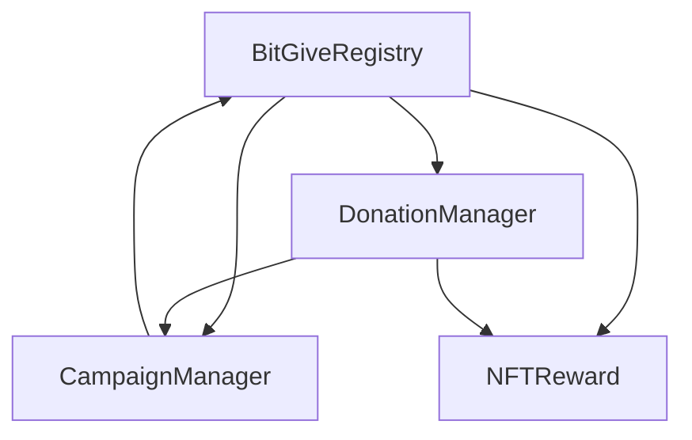

## BitGive - Blockchain Charity Platform


## Overview

BitGive is a decentralized charity platform built on blockchain technology that connects donors directly with charitable campaigns. The platform enables transparent tracking of donations, provides NFT rewards to donors, and ensures that funds reach their intended recipients with minimal overhead.

## Table of Contents

- [Features](#features)
- [Architecture](#architecture)
- [Smart Contracts](#smart-contracts)
- [Getting Started](#getting-started)
- [Development](#development)
- [Testing](#testing)
- [Deployment](#deployment)
- [UI Components](#ui-components)
- [Contributing](#contributing)
- [License](#license)


## Features
- **Transparent Campaigns**: Create and manage charitable campaigns with full transparency
- **Direct Donations**: Make donations directly to campaigns using cryptocurrency
- **NFT Rewards**: Receive unique NFT rewards based on donation tiers
- **Verification System**: Campaigns are verified by trusted verifiers
- **Impact Tracking**: Track the impact of donations through campaign updates


## Architecture
BitGive is built using:

- **Blockchain**: Ethereum-compatible networks
- **Smart Contracts**: Solidity contracts for core functionality
- **Frontend**: Next.js with Tailwind for the user interface


## Smart Contracts
The platform consists of the following core smart contracts:

1. **BitGiveRegistry**: Central registry that manages platform configuration, roles, and contract addresses
2. **CampaignManager**: Manages the creation, verification, and lifecycle of all campaigns
3. **DonationManager**: Manages donation processing and record-keeping
4. **NFTReward**: ERC-721 contract that issues NFT rewards to donors


### Contract Relationships



## Getting Started

### Prerequisites

- Node.js v16+
- npm or yarn
- MetaMask or another Ethereum wallet


### Installation

1. Clone the repository:
    ```shellscript
    git clone https://github.com/michojejunle/BitGive.git
    cd BitGive
    ```

2. Install dependencies:
    ```shellscript
    cd smart-contract
    npm install
    ```

3. Compile the smart contracts:
    ```shellscript
    npx hardhat compile
    ```

## Development

1. Add enviroment variables
    ```
    PINATA_API_KEY=your-pinata-api-key
    PINATA_API_SECRET=your-pinata-api-secret
    NEXT_PUBLIC_THIRDWEB_CLIENT_ID=your-thirdweb-client-id
    ```
2. Run the frontend development server:
    ```shellscript
    cd frontend
    npm install --legacy-peer-deps or pnpm install
    npm run dev or pnpm dev 
    ```

4. Open your browser and navigate to `http://localhost:3000`


## Testing

BitGive includes a comprehensive test suite for all smart contracts. The tests cover individual contract functionality, edge cases, and integration between contracts.

### Running Tests

Run all tests:
  ```shellscript
  cd smart-contract
  npx hardhat test
  ```

Run specific test file:
  ```shellscript
  npx hardhat test test/BitGiveRegistry.test.ts
  ```

Generate test coverage report:
  ```shellscript
  npx hardhat coverage
  ```

### Test Structure

The test suite is organized as follows:

- **Unit Tests**: Individual contract functionality
- **Integration Tests**: Interactions between contracts
- **Edge Cases**: Handling of unexpected inputs and conditions
- **Access Control**: Verification of role-based permissions
- **State Changes**: Validation of contract state changes


## Deployment

### Testnet Deployment

1. Configure your `.env` file with your private key and network details:
    ```plaintext
    PRIVATE_KEY=your_private_key
    ROOTSTOCK_TESTNET_RPC_URL=you-alchemy-rpc-url
    ```

2. Deploy to a testnet (e.g., RootstockTestnet):
   Create your ignition module (i.e. /ignition/modules/BitGiveRegistry.ts)
    ```
    // This setup uses Hardhat Ignition to manage smart contract deployments.
    // Learn more about it at https://hardhat.org/ignition
    
    import { buildModule } from "@nomicfoundation/hardhat-ignition/modules";
    
    const BitGiveRegistryModule = buildModule("BitGiveRegistryModule", (m) => {
    
      const BitGiveRegistry = m.contract("BitGiveRegistry");
    
      return { BitGiveRegistry };
    });
    
    export default BitGiveRegistryModule;
    ```

    ```shellscript
    npx hardhat ignition deploy ./ignition/modules/BitGiveRegistry.ts --network rootstock --verify
    ```

### Mainnet Deployment

For mainnet deployment, follow the same steps as testnet but use the mainnet network:

  ```shellscript
  npx hardhat ignition deploy ./ignition/modules/BitGiveRegistry.ts --network rootstockMainnet --verify
  ```

⚠️ **Important**: Always thoroughly test on testnets before deploying to mainnet.

## UI Components
The BitGive platform includes the following key UI components:

### Campaign Dashboard


The dashboard provides an overview of:
- Featured campaigns
- Recent donations
- Platform statistics

### Campaign Creation
Users can create campaigns by providing:

- Campaign name and description
- Funding goal and duration
- Category and impact metrics
- Campaign image


### Donation Flow
The donation process includes:

1. Connecting a wallet
2. Selecting a campaign
3. Choosing a donation amount
4. Confirming the transaction
5. Receiving an NFT reward if donation amount meets requirements 

### NFT Rewards Gallery


Donors can view their NFT rewards in the gallery, which displays:

- NFT image and metadata
- Campaign information
- Tier information


## Project Structure

```plaintext
bitgive/
├── smart-contract/         # Smart contracts
│   ├── BitGiveRegistry.sol
│   ├── CampaignManager.sol
│   ├── DonationManager.sol
│   └── NFTReward.sol
├── test/                   # Test files
│   ├── BitGiveRegistry.test.ts
│   ├── CampaignManager.test.ts
│   ├── DonationManager.test.ts
│   ├── NFTReward.test.ts
│   ├── Integration.test.ts
│   └── helpers.ts
├── frontend/              # Next.js frontend application
└── README.md              # Project documentation
```

## Contributing

Contributions are welcome to the BitGive platform! Please follow these steps to contribute:

1. Fork the repository
2. Create a feature branch (`git checkout -b feature/amazing-feature`)
3. Commit your changes (`git commit -m 'Add some amazing feature'`)
4. Push to the branch (`git push origin feature/amazing-feature`)
5. Open a Pull Request


Please ensure your code follows our coding standards and includes appropriate tests.

## License

This project is licensed under the MIT License - see the [LICENSE](LICENSE) file for details.


## Contact

For questions or support, please contact:

- Email: [michojekunle1@gmail.com](mailto:michojekunle1@gmail.com)
- Twitter: [@devvmichael](https://twitter.com/devvmichael)
